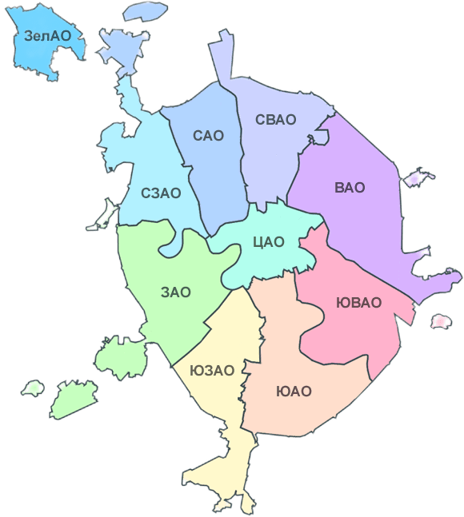
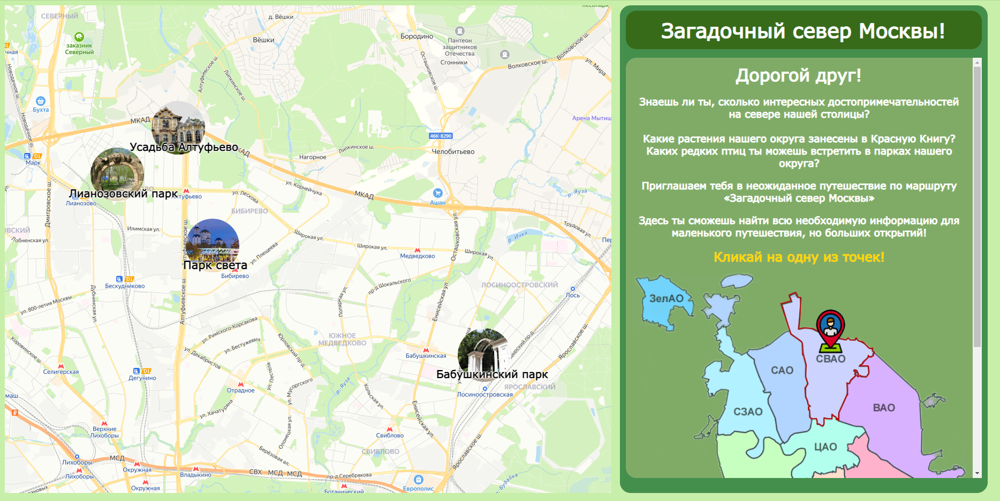
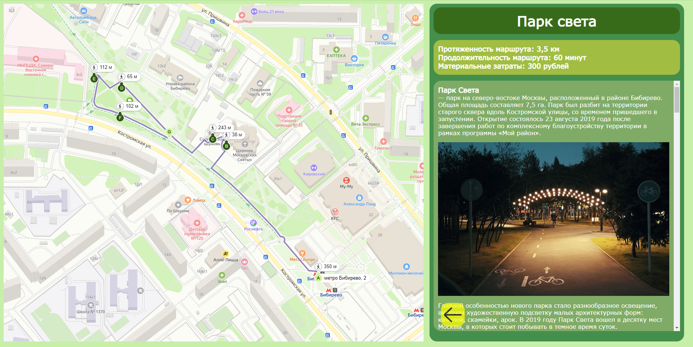

# Проект интерактивной карты СВАО Москвы

Добро пожаловать на интерактивную карту достопримечательностей СВАО (Северо-Восточного административного округа) Москвы. Она разработана в целях развития экотуризма в условиях городской среды.



## Проблема
В настоящее время в мире наблюдается увеличение интереса к экологическому туризму. При  правильном планировании и реализации экотуризм является прибыльной экономической отраслью. 

В России тоже наблюдается увеличение интереса к экологическому туризму, однако в нашей стране экотуризм находится на стадии становления. В высших учебных заведениях нет специального направления подготовки по экологическому туризму, существует проблема неотрегулированности отношений в системе "туризм-экология", есть проблемы, связанные с  развитием инфраструктуры. Недостаточно развит экотуризм в больших городах, хотя тенденция "близости к природе" приобретает большое значение особенно для жителей больших городов. 

Все более возрастающая урбанизация определяет новые взгляды и подходы к развитию экотуризма – это экотуризм на особо охраняемых природных территориях, а также зелёных зонах города. Кроме того, интересными объектами с точки зрения экотуризма в условиях городской среды могут стать городские строения и сооружения, имеющие эколого-ориентированную специфику, например, спроектированные по принципам экоурбанистики, а также архитектура, удачно вписанная в ландшафт (например, старинные усадьбы). Однако, в настоящее время эти подходы не разработаны.

## Цель
Создать сайт, на котором пользователи смогут: 
 - найти **интересные** места для прогулки в городе,
 - смотреть **уже готовые** маршруты по городу,
 - **планировать** бюджет и время прогулки,
 - **узнать** историю и описание пройденых достопримечательностей.

## Использование

На данный момент сайт работает на облачном сервисе Google Firebase по ссылке: https://svao-map-trpp.web.app/

При попадании на сайт, слева на интерактивной Яндекс-карте будут изображены точки маршрутов и приветствие справа.



При нажатии на одну из точек, слева мы увидим подробный маршрут с расстояниями. Справа будет изображено название, краткое описание по маршруту, а также подробное описание, история и картинки достопримечательностей, которые можно встретить на маршруте.



```
def say_hello():
    print("Hello, World!")

say_hello()
```
